:revealjs_theme: white
:customcss: index.css

= Chiffrement et Certificats

== Vocabulaire et introduction

=== Terminologie

* Cryptographie : Protection d'un message à l'aide d'une clé de chiffrement
* Cryptogramme : Message chiffré auquel on a appliqué une technique de cryptographie
* Cryptanalyse : Science qui consiste à déchiffrer un cryptogramme sans posséder la clé, décrypter
* Cryptage : Anglicisme qui ne veut normalement rien dire

=== À quoi ça sert ?

« La sécurité est une fonction incontournable des réseaux. Puisqu’on ne voit pas son correspondant directement, il faut l’**authentifier**. Puisqu’on ne sait pas par où passent les données, il faut les **chiffrer**. Puisqu’on ne sait pas si quelqu’un ne va pas modifier les informations émises, il faut vérifier leur **intégrité**. »

Guy Pujolle, « Les Réseaux », Éditions Eyrolles, 2014, p. 641

=== À quoi ça sert ?

Les principaux objectifs de la cryptographie :

* Intégrité : Assurer que les données n’ont pas été modifiées lors de leur transmission
* Authenticité : Vérifier l’identité d’une personne ou d’un ordinateur
* Confidentialité : Assurer que l’information n’est accessible qu’à ceux dont l’accès est autorisé

=== Comment on fait ?

Pour atteindre ces différents objectifs :

* Intégrité des données : Garantie par une « empreinte », obtenue via des fonctions de hachage
* Authenticité d’un message : Garantie par l’apposition d’une « signature numérique » (empreinte chiffrée)
* Confidentialité des données : Garantie par le « chiffrement », grâce un algorithme cryptographique

=== Ressources

* Wikipédia : https://fr.wikipedia.org/wiki/Cryptographie[Cryptographie]
* Wikipédia : https://fr.wikipedia.org/wiki/Confidentialit%C3%A9[Confidentialité]
* Wikipédia : https://fr.wikipedia.org/wiki/Authentification[Authenticité]
* Wikipédia : https://fr.wikipedia.org/wiki/Int%C3%A9grit%C3%A9_(cryptographie)[Intégrité]

=== Questions ?

== Cryptographie symétrique

=== Définition

On utilise des algorithmes dits symétriques, qui sont publics (cf. exemples), avec des clés secrètes. Afin de pouvoir chiffrer et déchiffrer les données, tous les participants à la communication doivent partager la même clé secrète. D’où le nom « symétrique », la clé est la même de deux côtés d’une connexion.

Exemples d’algorithmes symétriques : https://fr.wikipedia.org/wiki/Advanced_encryption_standard[AES], https://fr.wikipedia.org/wiki/International_Data_Encryption_Algorithm[IDEA], https://fr.wikipedia.org/wiki/Triple_DES[3DES], https://fr.wikipedia.org/wiki/Blowfish[Blowfish], etc.

=== Avantages / Inconvénients

Comparée à l’asymétrique, la symétrique a les avantages suivants :

* Simplicité de mise en œuvre
* Léger en terme de consommation CPU
* Chiffrement robuste

Malgré ces avantages, le chiffrement symétrique à un inconvénient de taille :

* L’échange de clé

=== Fonctionnement

[transition=none]
=== !

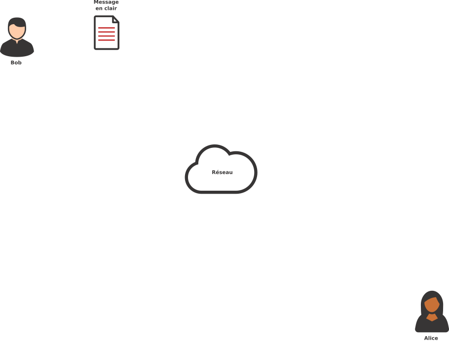

[.notes]
--
Bob veut envoyer un message à Alice.
--

[transition=none]
=== !

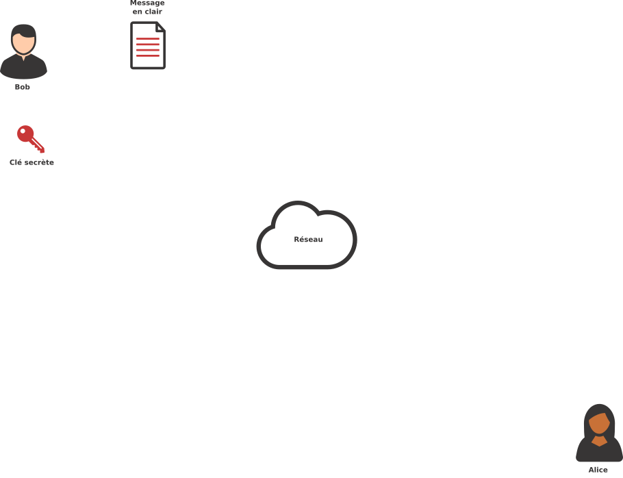

[.notes]
--
Bob génère un clé secrète.
--

[transition=none]
=== !

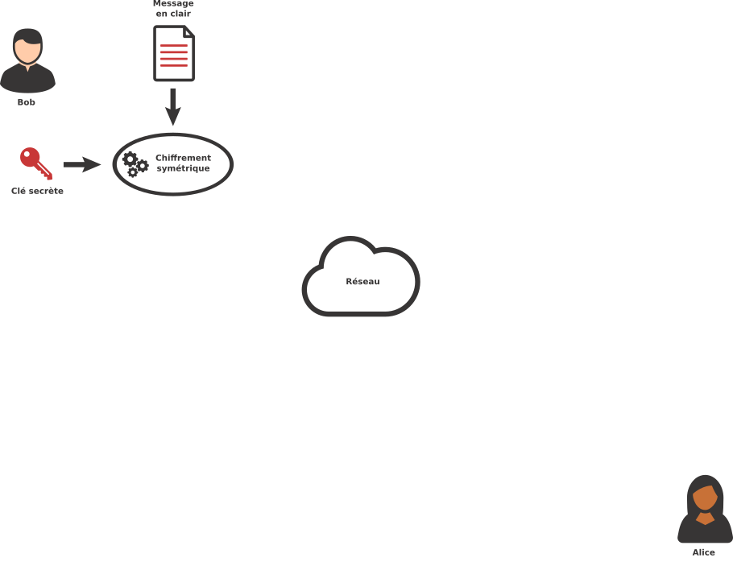

[.notes]
--
Bob chiffre son message à l’aide d’un algorithme de chiffrement symétrique et la sa clé secrète.
--

[transition=none]
=== !

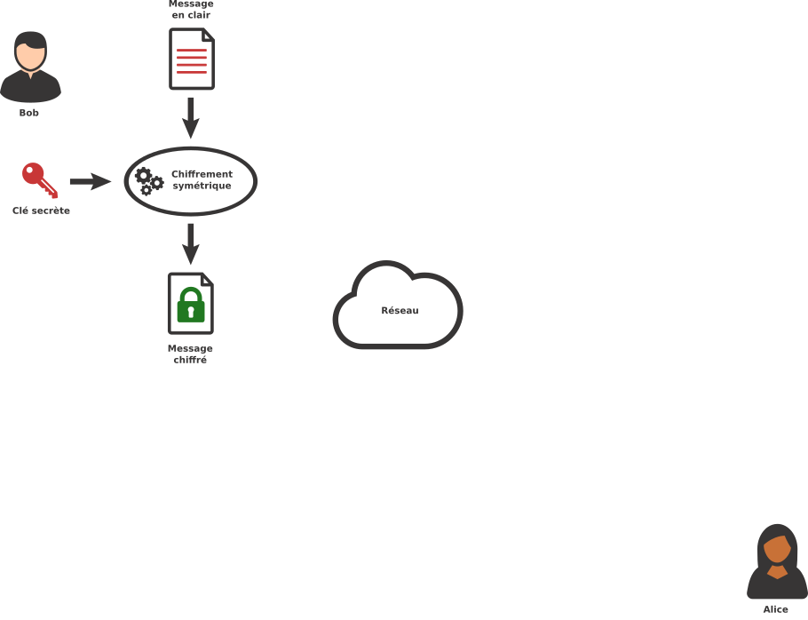

[.notes]
--
Bob obtient un cryptogramme.
--

[transition=none]
=== !

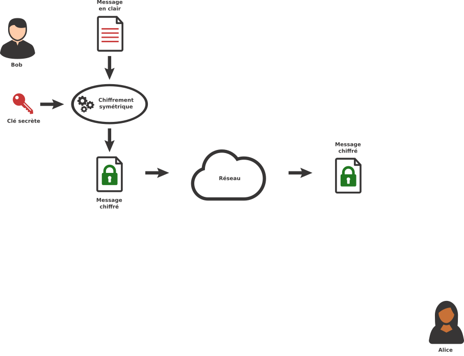

[.notes]
--
Bob envoie le cryptogramme à Alice à travers le réseau.
--

[transition=none]
=== !

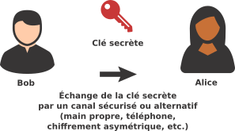

[.notes]
--
Bob et Alice se rencontrent pour échanger la clé de manière sécurisée.
--

[transition=none]
=== !

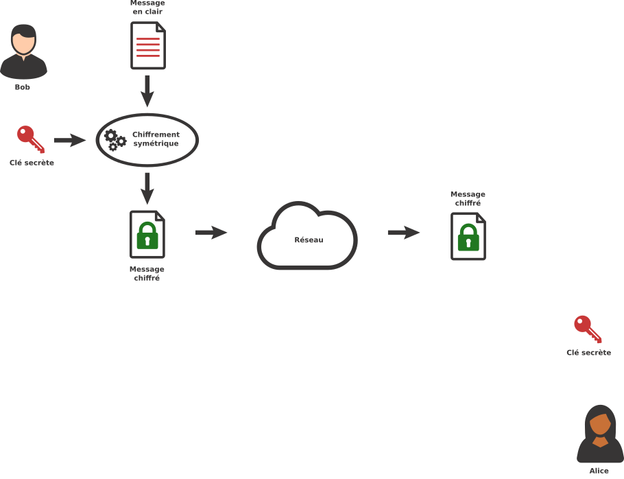

[.notes]
--
Alice est en possession de la clé secrète de Bob.
--

[transition=none]
=== !

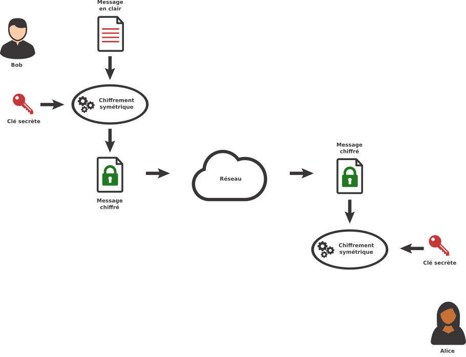

[.notes]
--
Avec la clé secrète, Alice déchiffre le cryptogramme de Bob à l’aide de l’algorithme de chiffrement symétrique.
--

[transition=none]
=== !

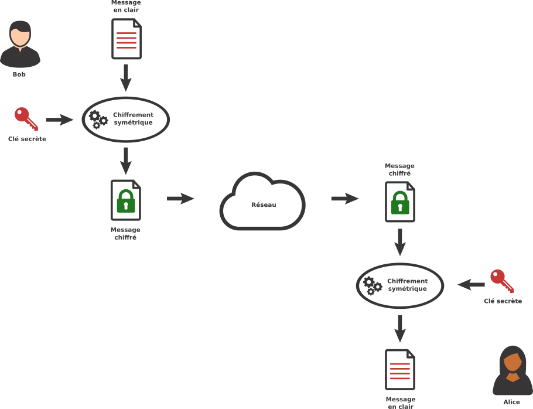

[.notes]
--
Alice obtient le message en clair de Bob.
--

=== Ressources

* Wikipédia : https://fr.wikipedia.org/wiki/Chiffrement[Chiffrement]
* Wikipédia : https://fr.wikipedia.org/wiki/Cryptographie_sym%C3%A9trique[Symétrique]

=== Questions ?

== Cryptographie asymétrique

=== Définition

On utilise des algorithmes dits asymétriques, qui sont publics (cf. exemples), avec une paire de clés : une clé publique et une clé privée. La particularité des algorithmes asymétriques est qu’un message chiffré avec une clé publique n’est lisible que par le propriétaire de la clé privée correspondante.

Exemples d’algorithmes asymétriques : RSA, El Gamail, etc.

=== Avantages / Inconvénients

Par rapport au chiffrement symétrique, l’asymétrique à cet avantage :

* De pouvoir communiquer via un canal non sécurisé

Les avantages du symétrique s’opposent aux inconvénients de l’asymétrique :

* Complexité de mise en œuvre
* Davantage consommateur en ressources
* Chiffrement moins robuste

=== Fonctionnement

[transition=none]
=== !

[.notes]
--
Bob veut envoyer un message à Alice.
--

[transition=none]
=== !

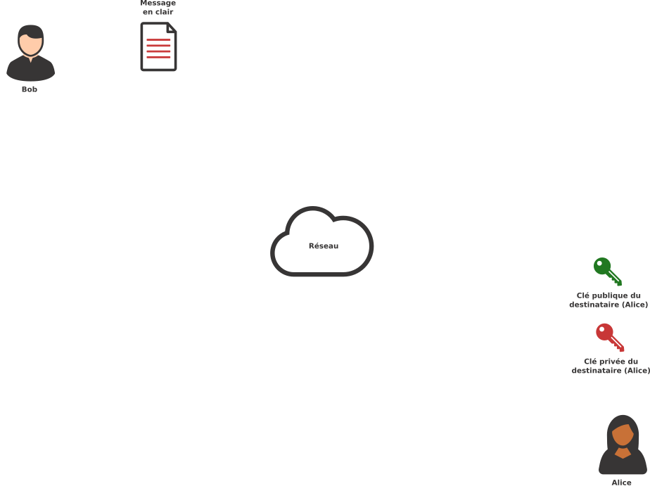

[.notes]
--
Alice génère une paire de clés (privée et publique).
--

[transition=none]
=== !

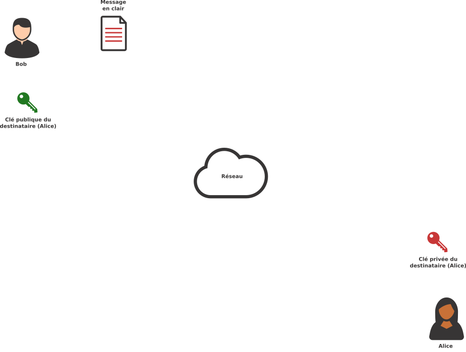

[.notes]
--
Alice envoie sa clé publique à Bob.
--

[transition=none]
=== !

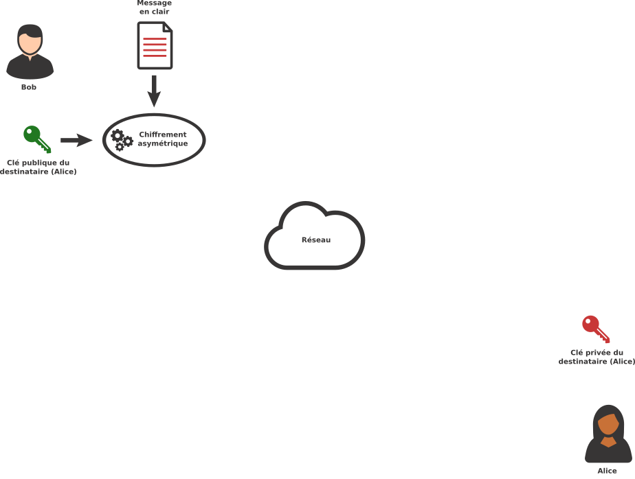

[.notes]
--
Avec la clé publique d’Alice, Bob chiffre son message à l’aide d’un algorithme de chiffrement asymétrique.
--

[transition=none]
=== !

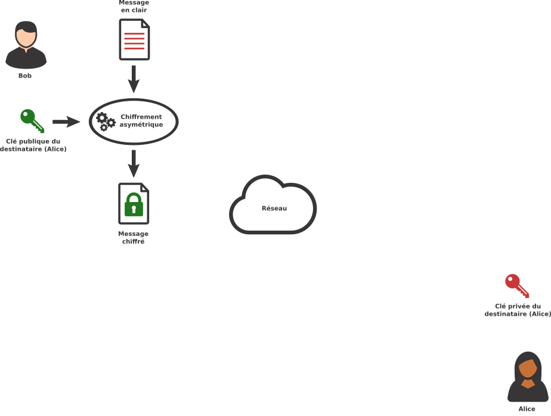

[.notes]
--
Il obtient un cryptogramme.
--

[transition=none]
=== !

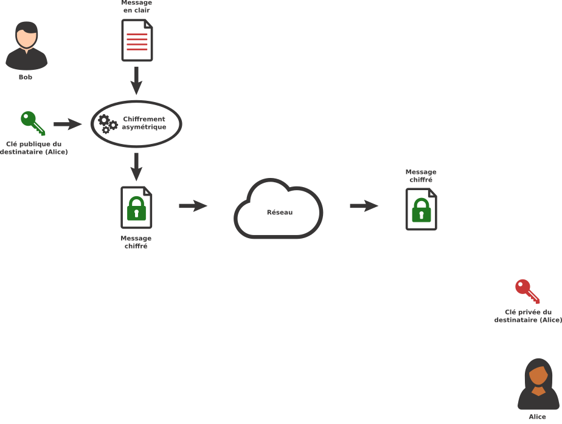

[.notes]
--
Il l’envoie à Alice à travers le réseau.
--

[transition=none]
=== !

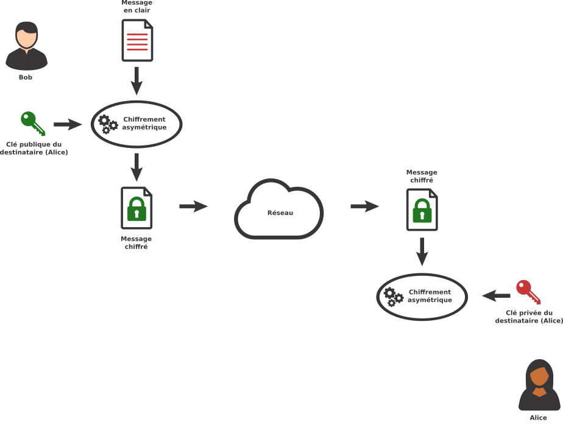

[.notes]
--
Alice utilise sa clé privée pour déchiffrer le cryptogramme, à l’aide de l’algorithme de chiffrement asymétrique.
--

[transition=none]
=== !

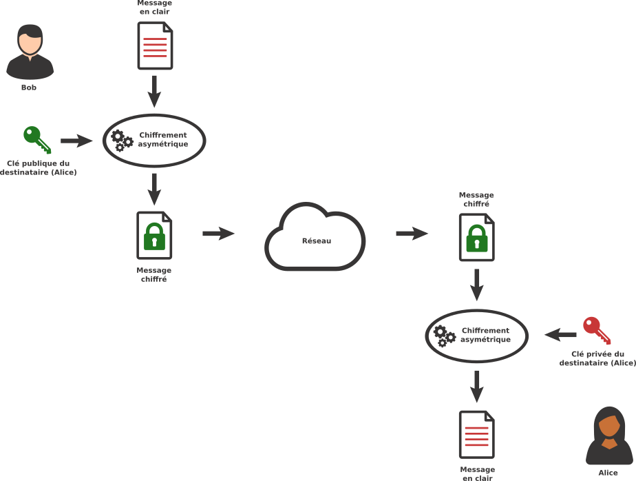

[.notes]
--
Alice obtient le message en clair de Bob.
--

=== Ressources

* Wikipédia : https://fr.wikipedia.org/wiki/Chiffrement[Chiffrement]
* Wikipédia : https://fr.wikipedia.org/wiki/Cryptographie_asym%C3%A9trique[Asymétrique]

=== Questions ?

== Cryptographie hybride

=== Définition

Pour faire de la cryptographie hybride, on chiffre le contenu par chiffrement symétrique avec une clé de session aléatoire, et on chiffre la clé de session par chiffrement asymétrique avec la clé publique du destinataire.

Exemples de technologies mettant en œuvre de la cryptographie hybride : PGP, TLS

=== Avantages / Inconvénients

On a donc les avantages du symétrique et de l’asymétrique suivants :

* Communication via un canal non sécurisé
* Consommation de ressources raisonnable
* Chiffrement robuste

Toutefois un inconvénient demeure :

* Complexité d’autant plus grande

=== Fonctionnement

[transition=none]
=== !

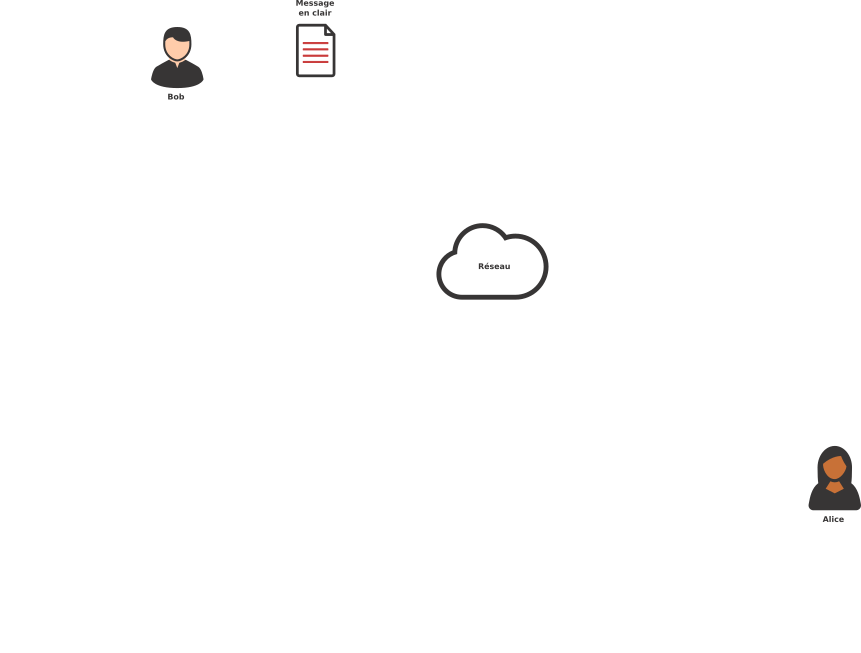

[.notes]
--
Bob veut envoyer un message à Alice.
--

[transition=none]
=== !

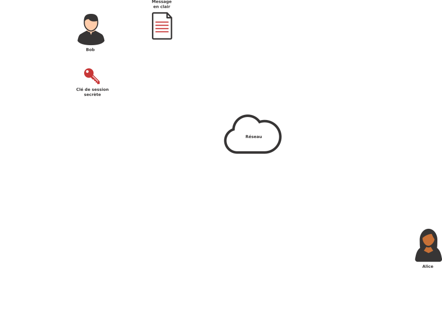

[.notes]
--
Bob génère une clé de session.
--

[transition=none]
=== !

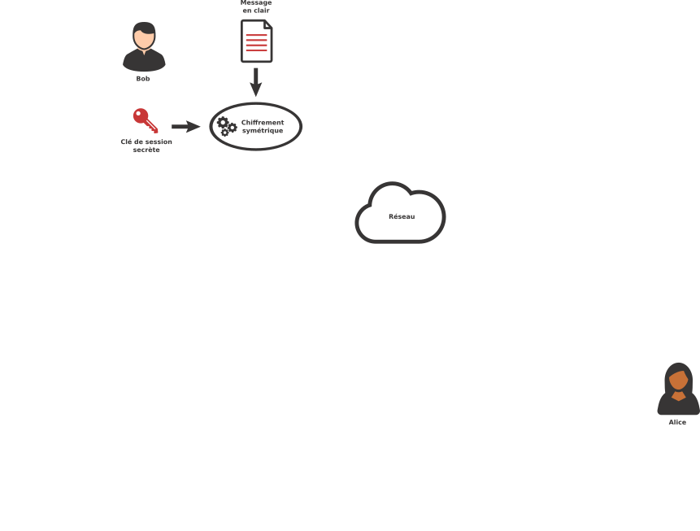

[.notes]
--
Avec la clé de session, Bob chiffre son message à l’aide d’un algorithme de chiffrement symétrique.
--

[transition=none]
=== !

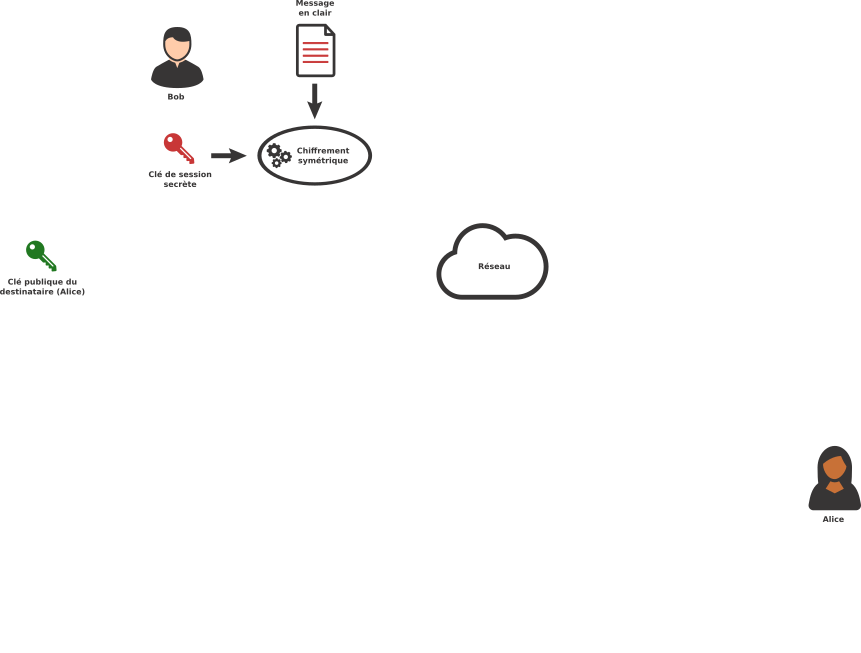

[.notes]
--
Bob récupère la clé publique de Alice.
--

[transition=none]
=== !

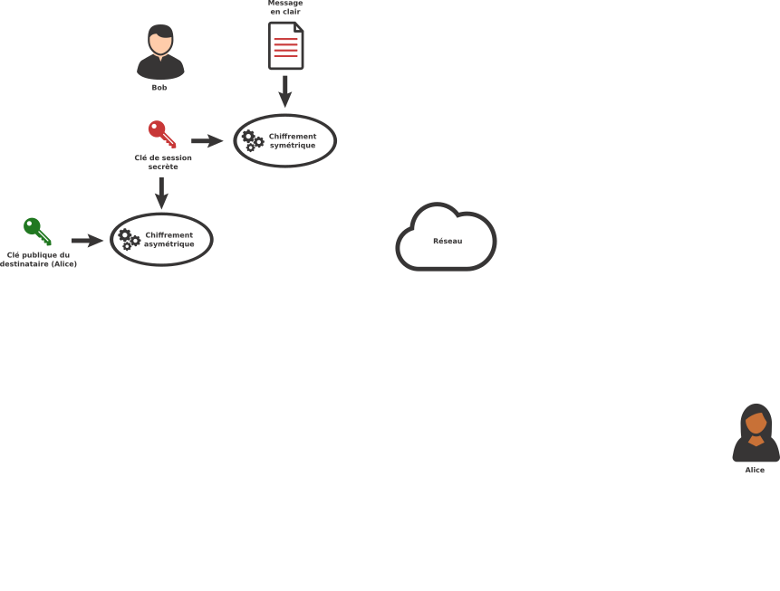

[.notes]
--
Avec la clé publique d’Alice, Bob chiffre la clé de session à l’aide d’un algorithme de chiffrement asymétrique.
--

[transition=none]
=== !

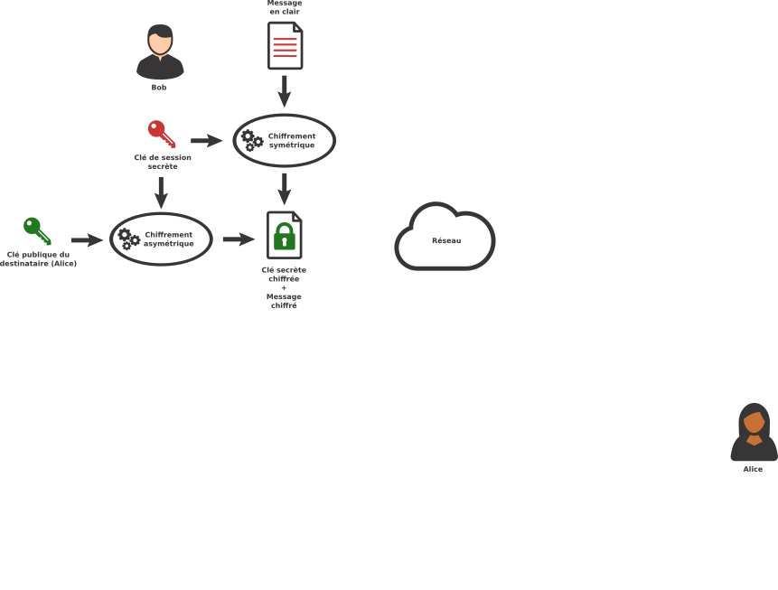

[.notes]
--
Bob joint la clé secrète chiffrée (asymétrique) et le message chiffré (symétrique).
--

[transition=none]
=== !

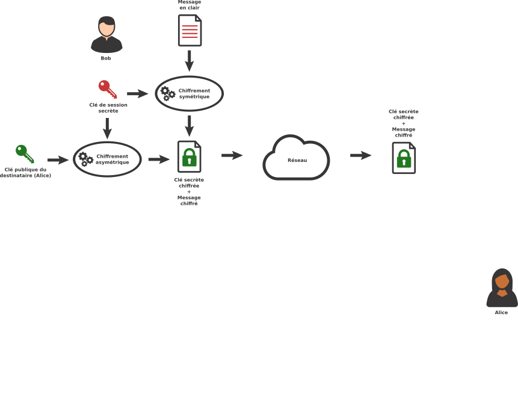

[.notes]
--
Bob envoie le cryptogramme à Alice à travers le réseau.
--

[transition=none]
=== !

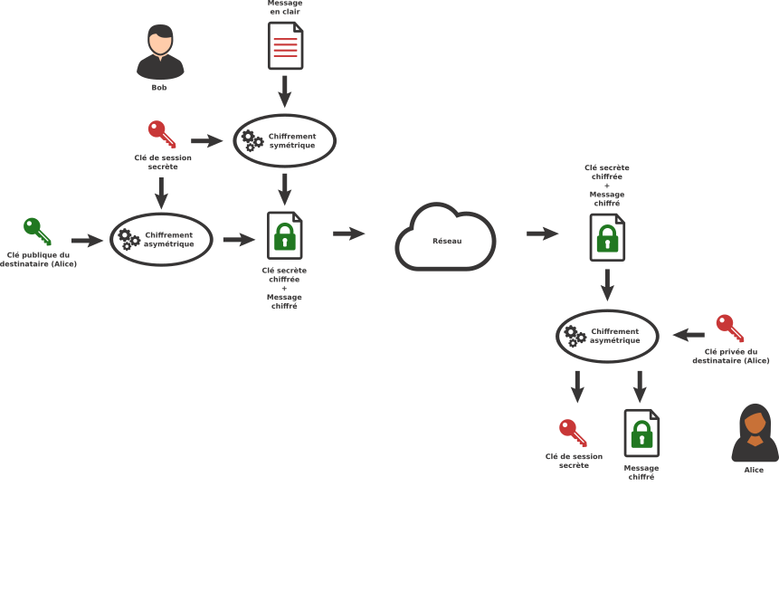

[.notes]
--
Avec sa clé privée, Alice déchiffre la clé de session chiffrée à l’aide de l’algorithme de chiffrement asymétrique.
--

[transition=none]
=== !

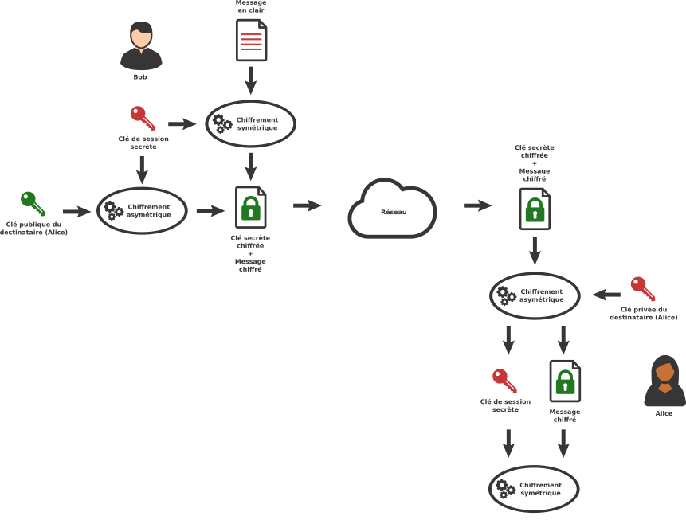

[.notes]
--
Avec la clé de session, Alice déchiffre le message chiffré.
--

[transition=none]
=== !

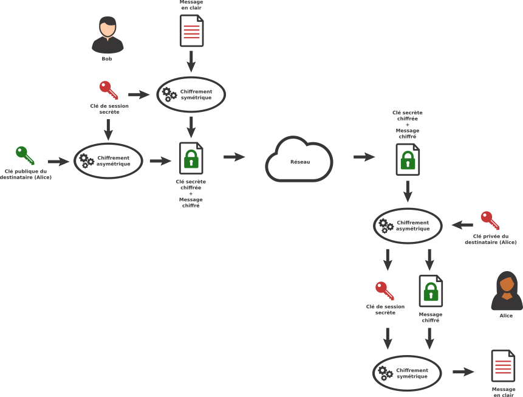

[.notes]
--
Alice obtient le message en clair de Bob.
--

=== Ressources

* Wikipédia : https://fr.wikipedia.org/wiki/Chiffrement[Chiffrement]
* Wikipédia : https://fr.wikipedia.org/wiki/Cryptographie_hybride[Hybride]

=== Questions ?

== Fonction de hachage

=== Définition

Une fonction de hachage est une fonction qui convertit un grand ensemble en un plus petit ensemble, appelé « empreinte ». Il est impossible de la déchiffrer pour revenir à l’ensemble d’origine, ce n’est donc pas une technique de chiffrement.

Exemples de fonctions de hachage : https://fr.wikipedia.org/wiki/MD5[MD5], https://fr.wikipedia.org/wiki/SHA-0[SHA], https://fr.wikipedia.org/wiki/SHA-1[SHA-1], https://fr.wikipedia.org/wiki/SHA-2[SHA-2], etc.

=== Fonctionnement

On applique une fonction de hachage sur les données, pour obtenir en sortie l’empreinte des données.

=== Ressources

* Wikipédia : https://fr.wikipedia.org/wiki/Fonction_de_hachage[Hachage]
* Ippon : https://blog.ippon.fr/2017/02/28/sha-1-hachage-et-securite/[Hachage]

=== Questions ?

== Signature numérique

=== Définition

La signature numérique est un mécanisme permettant de garantir l'intégrité d'un document électronique et d'en authentifier l'auteur, par analogie avec la signature manuscrite d'un document papier.

=== Signature

[transition=none]
=== !

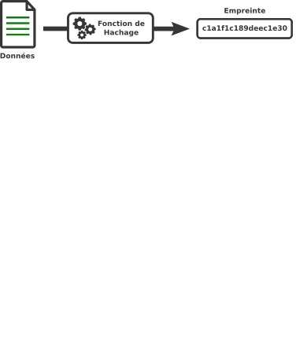

[.notes]
--
On génère l’empreinte des données.
--

[transition=none]
=== !

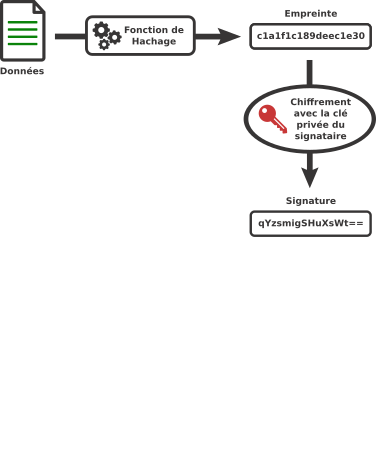

[.notes]
--
On chiffre l’empreinte avec notre clé privée, pour obtenir notre signature.
--

[transition=none]
=== !

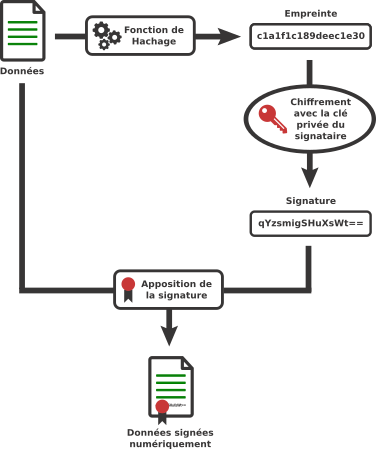

[.notes]
--
On joint la signature aux données à transmettre.
Si lors du transfert les données étaient modifiées par un attaquant, l’empreinte serait différente et pour régénérer notre signature il lui faudrait notre clé privée.
De même, si un attaquant voulait se faire passer pour nous, il lui faudrait notre clé privée.
--

=== Authentification

[transition=none]
=== !

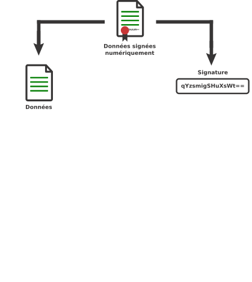

[.notes]
--
Le destinataire récupère les données avec notre signature.
--

[transition=none]
=== !

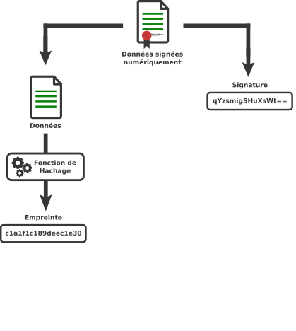

[.notes]
--
Le destinataire génère l’empreinte des données en sa possession.
--

[transition=none]
=== !

image::images/signature/image6.png[width=50%]

[.notes]
--
Avec notre clé publique, le destinataire déchiffre la signature pour obtenir notre empreinte.
--

[transition=none]
=== !

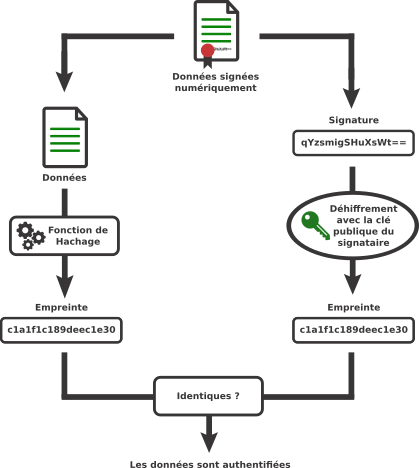

[.notes]
--
Si les deux empreintes, celle du destinataire et celle issue de notre signature, correspondent, alors les données sont intègres et authentifiées.
--

=== Ressources

* Wikipédia : https://fr.wikipedia.org/wiki/Signature_num%C3%A9rique[Signature]

=== Questions ?

== Infrastructure à clé publique

=== Définition

Une PKI (Public Key Infrastructure) est :

* un ensemble de composants physiques,
* de procédures humaines
* et de logiciels en vue de gérer le cycle de vie des certificats numériques.

Une PKI fournit des garanties permettant de faire confiance à un certificat signé par une autorité de certification.

=== Certificat numérique

Le certificat peut être vu comme une carte d’identité numérique. Il est utilisé principalement pour identifier et authentifier une personne physique ou morale, mais aussi pour chiffrer des échanges. Il est signé par un tiers de confiance qui atteste du lien entre l’identité physique et l’entité numérique. Le standard le plus utilisé pour la création des certificats numériques est le PKIX, une adaptation de X.509.

=== Autorité de Certification

Une CA (Certificate Authority = Autorité de Certification) est un tiers de confiance permettant d’authentifier l’identité des correspondants.

Une autorité de certification délivre des certificats décrivant des identités numériques et met à disposition les moyens de vérifier la validité des certificats qu’elle a fourni.

Exemple : https://letsencrypt.org[LetsEncrypt]

=== Autorité de Certification

La clé privée de la CA est utilisée pour signer tous les certificats émis, de sorte que sa sécurité est essentielle pour maintenir l’ensemble de la PKI en sécurité.

Pour cette raison, il est fortement recommandé que la structure de la CA soit conservées sur un système sécurisé dédié à cet usage ; ce n’est pas une bonne idée de mélanger la CA avec l’entité finale demandeuse de certificats, telle que les clients ou les serveurs (VPN, Web, etc.).

=== Fonctionnement

[transition=none]
=== !

[.notes]
--
Bob veut un certificat authentifié par un tiers de confiance.
--

[transition=none]
=== !

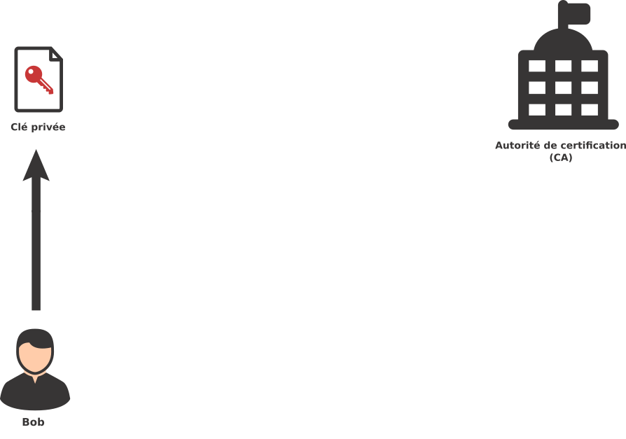

[.notes]
--
Il génère une clé privée.
--

[transition=none]
=== !

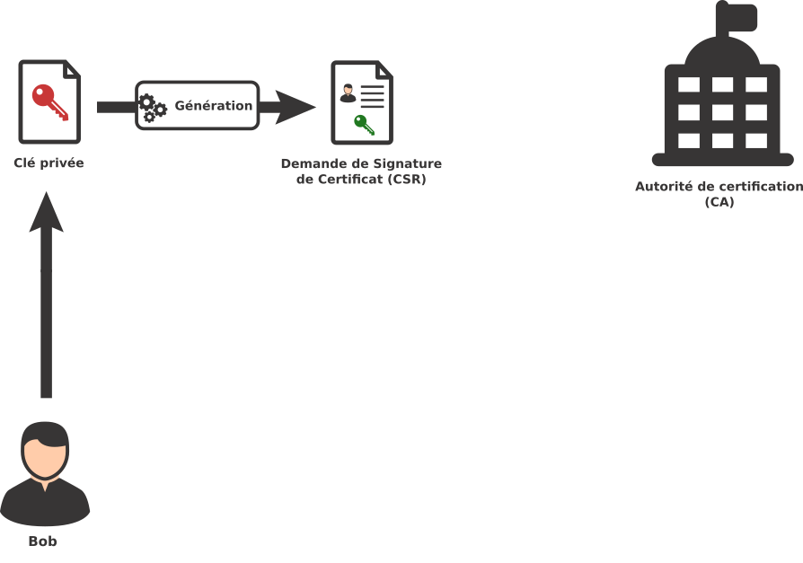

[.notes]
--
Grâce à la clé privée, il génère une demande de signature de certificat.
--

[transition=none]
=== !

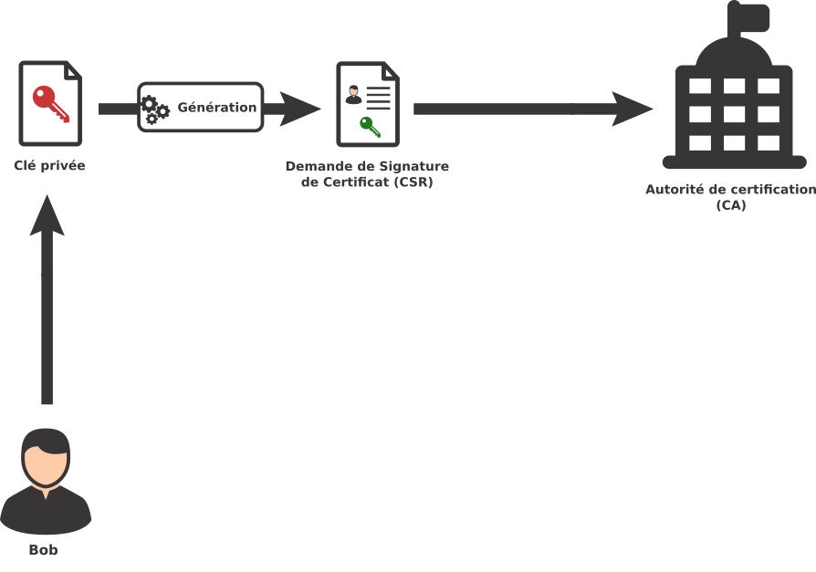

[.notes]
--
Il envoie sa demande à une autorité de certification.
--

[transition=none]
=== !

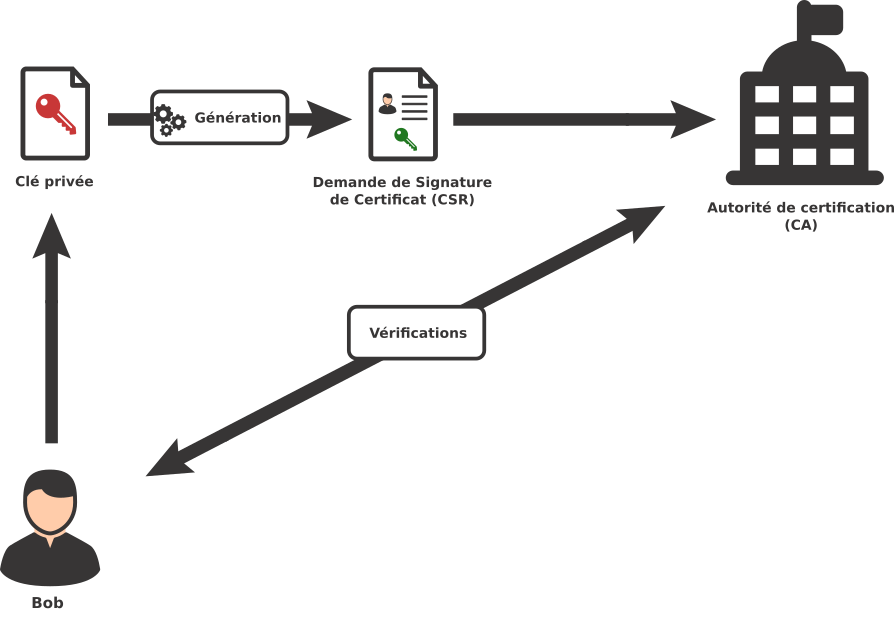

[.notes]
--
L’autorité de certification fait les vérifications nécessaires à l’authentification de la demande.
--

[transition=none]
=== !

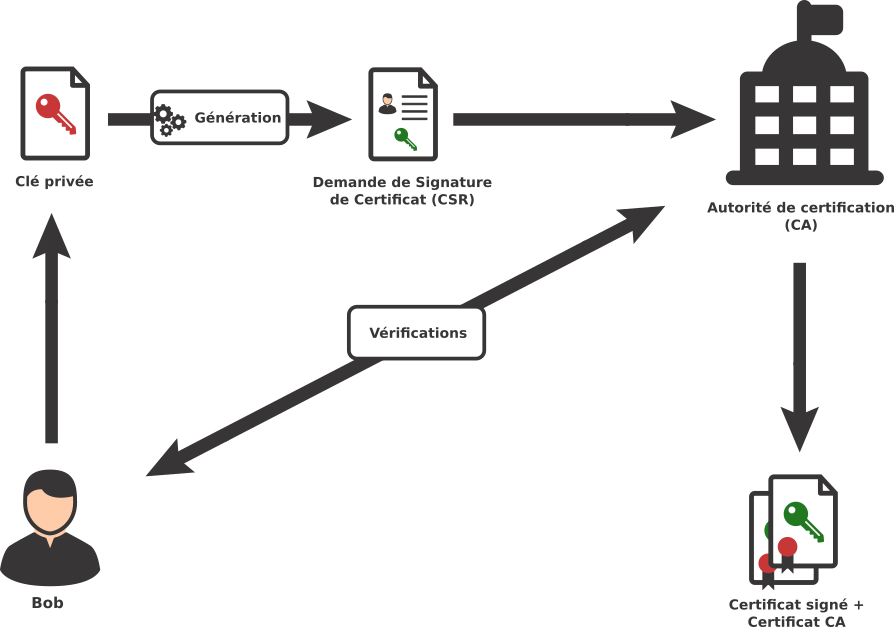

[.notes]
--
Si l’identité du demandeur est validée, l’autorité de certification signe le certificat.
--

[transition=none]
=== !

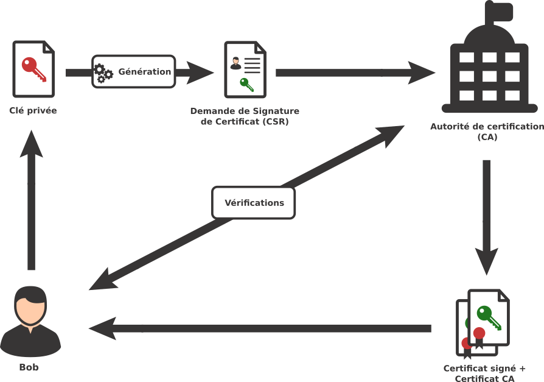

[.notes]
--
Et l’envoie au demandeur.
--

=== Avantages / Inconvénients

L’avantage d’une PKI/CA est le suivant :

* Permet une gestion centralisée des clés publiques

Cependant, pour les CA publiques, le gros inconvénient est que :

* Il est nécessaire de faire confiance à tous les maillons de la chaîne

=== DANE / TLSA

Pour pallier à des attaques de type MITM, ou au manque de confiance accordable aux CA, il existe le protocole DANE. Celui-ci permet de publier dans le DNS (sécurisé à l’aide de DNSSEC) des enregistrements de type TLSA.

Un enregistrement TLSA peut indiquer la CA à interroger, ou contenir le certificat lui-même (ou son empreinte). Ça permet donc de mettre une contrainte sur la CA, ou de se passer complètement d’une CA.

Inconvénient : potentiellement peu performant, très peu supporté et déployé...

=== CAA

DNS Certification Authority Authorization (CAA) est une spécification basée sur le DNS permettant au titulaire d'un nom de domaine de lister les CA qui sont autorisées à délivrer des certificats pour ce domaine. Ce mécanisme n'est pas censé servir de vérification supplémentaire pour un client TLS mais plutôt de confirmation/refus aux autorités de certification dans leurs processus d'émission de certificat.

Inconvénient : dépend du bon vouloir des CA à s’y conformer...

=== Ressources

* Wikipédia : https://fr.wikipedia.org/wiki/Infrastructure_%C3%A0_cl%C3%A9s_publiques[PKI] / https://fr.wikipedia.org/wiki/Autorit%C3%A9_de_certification[CA] / https://fr.wikipedia.org/wiki/ACME_(protocole)[ACME]
* Wikipédia : https://fr.wikipedia.org/wiki/Certificat_%C3%A9lectronique[Certificat] / https://fr.wikipedia.org/wiki/PKIX[PKIX] / https://fr.wikipedia.org/wiki/X.509[X.509]
* Wikipédia : https://fr.wikipedia.org/wiki/DNS_-_based_Authentication_of_Named_Entities[DANE] / https://fr.wikipedia.org/wiki/DNS_Certification_Authority_Authorization[CAA]

=== Questions ?

== TLS

=== Définition

TLS (remplaçant de SSL) est un protocole de sécurisation des échanges sur Internet. Dans la pile de protocole TCP/IP, il se situe entre la couche application et la couche transport TCP.

Une application TCP utilisant TLS fonctionne sur un nouveau port. Certaines applications peuvent fonctionner sur le même port grâce au mécanisme StartTLS, on parle alors de « chiffrement opportuniste », la communication peut débuter en clair et passer en chiffrée à l’initiative du client ou du serveur si les deux le supportent.

=== Fonctionnement

[transition=none]
=== !

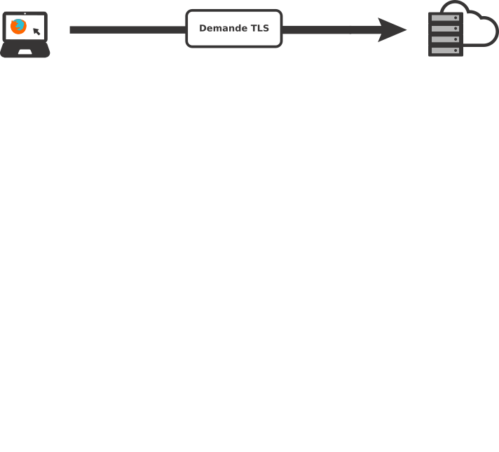

[.notes]
--
Le navigateur du client demande au serveur une connexion sécurisée par TLS.
Lors de cette étape, qu’on appelle handshake, le client et le serveur se mettent d’accord sur le protocole et les suites de chiffrement à utiliser.
--

[transition=none]
=== !

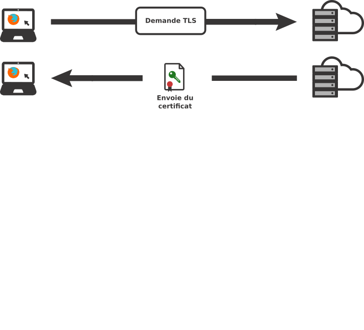

[.notes]
--
Le serveur envoie son certificat.
--

[transition=none]
=== !

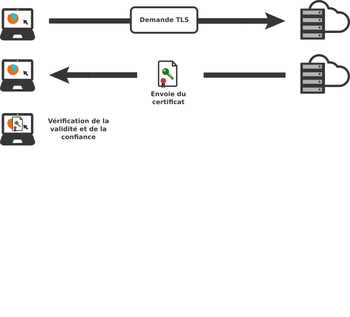

[.notes]
--
Le navigateur vérifie la validité du certificat, notamment auprès des autorités de certification auxquelles il fait confiance (dans son « magasin de certificats »).
Si le certificat est invalide ou n’est signé par aucune autorité certification connue, le navigateur affiche un avertissement.
--

[transition=none]
=== !

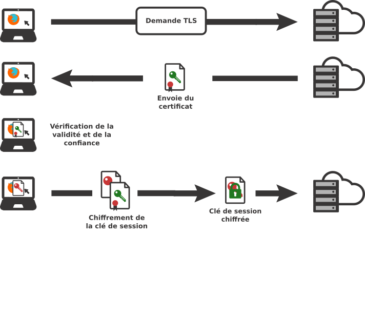

[.notes]
--
Le navigateur génère une clé de session, la chiffre avec le certificat et l’envoie au serveur.
--

[transition=none]
=== !

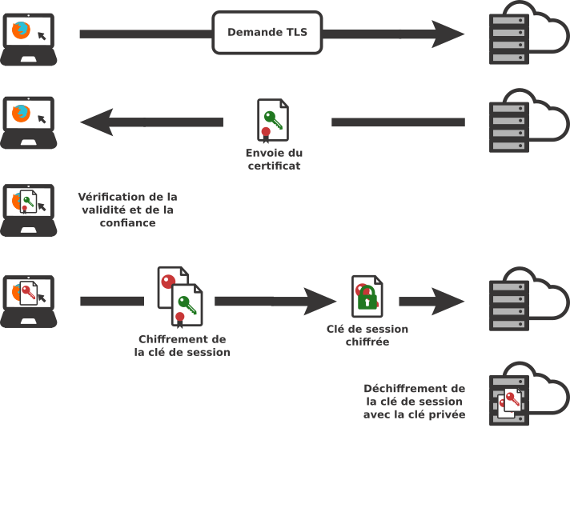

[.notes]
--
Le serveur déchiffre la clé de session avec sa clé privée.
--

[transition=none]
=== !

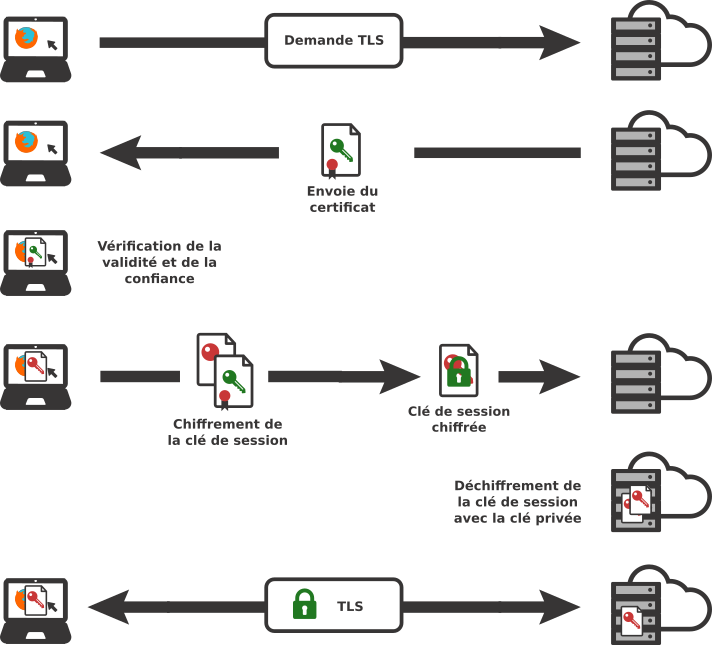

[.notes]
--
Connexion TLS établie, le client et le serveur échangent des données chiffrées grâce à la clé de session.
Une fois la connexion terminée ou expirée, le serveur révoque la clé de session.
--

=== Ressources

* Wikipédia : https://fr.wikipedia.org/wiki/Transport_Layer_Security[TLS]
* OpenWeb : https://openweb.eu.org/articles/https-de-ssl-a-tls-1-3[SSL/TLS]
* Illustrated TLS : https://tls.ulfheim.net/[TLS] / https://tls13.ulfheim.net/[TLV 1.3]
* IEUFI : https://www.iletaitunefoisinternet.fr/post/2-ssl-sonntag/[SSL/TLS]
* NGINX : https://www.nginx.com/blog/nginx-https-101-ssl-basics-getting-started/[HTTPS 101]

=== Questions ?

== TP

* <https://git.karolak.fr/assr/crypto-tp>

== Veille

* Podcast dédié à la cyber sécurité : <https://www.nolimitsecu.fr/> (fr)
* Lettre d'information autour de TLS : <https://www.feistyduck.com/bulletproof-tls-newsletter/> (en)
* Blog de Mozilla dédié à la sécurité : <https://blog.mozilla.org/security/> (en)
* Journal du Hacker (tag: sécurité) : <https://www.journalduhacker.net/t/s%C3%A9curit%C3%A9> (fr)
* Lobsters (tag: security) : <https://lobste.rs/t/security> (en)
